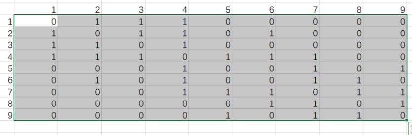

# ppt主题更新

开发工具：pycharm

开发语言：python

## 功能简介
当我们厌倦了同一个 ppt 中的相同风格，我们就会想：ppt 能否也可以便捷地去更换主题而不用手动
输入？微软提供的 pptx 一键换肤功能只能替换少量固定的组件，无法真正满足用户的需求。因此我实现
了的 ppt 主题更换功能，可以自行选择喜欢的主题进行切换。

## 基本实现思路

本功能实现的 ppt 主题更换本质上是对 ppt 中所有组件颜色的更换，因此每一种主题的本质是 4 种
不同颜色。

预先选择合适的颜色搭配，设置颜色类。我们预先提供了 7 种主题颜色搭配

扫描每 ppt 中每一页的每一个组件，对原有的组件的按主题颜色顺序进行循环涂色。遍历完 ppt 中
的每一个组件，即实现了组题更换功能。

## 难点处理

在实战中发现，基本的实现思路是无法满足正确涂色功能的。一个 ppt 中存在各种各样不同的组件，
并非每一种组件都可以直接涂色的，或者说并非每一种组件都应该涂色的。

经过总结，我们需要分模块处理以下几种特殊状况：

1. 组合组件：针对组合组件我们应该递归遍历其所有子组件，对所有子组件进行单独的颜色更换。

2. 填充类型为图片的组件：对于填充类型为图片的组件，我们不应该对其进行填色，填色会覆盖掉
原本的图片

3. 对于类型为 chart 的组件：类型为 chart 的组件多是柱状图一类，统一上色和随机上色都会破坏
柱状图的柱状颜色，破坏本意。因此我们应该对柱状图横坐标中的对应每一种类型的柱子进行同一上色，
但不同类型的柱子应该处理为不同颜色

4. 对于 table 类型的组件：表格类型的组件，我们的期望是给标题栏涂上一种颜色，紧接着下来的
每一行交错上色：

5. 对于文本框组件：不应特殊处理，文本框的背景不应该随着主题的改变而变更

6. 对于 auto-shape 类型的组件：auto-shape 类型的组件是 ppt 组成的大部分组件内容。auto-shape
类型的组件也需要有更细致的划分，一个 ppt 中可能存在无填充类型，视觉上看不见的透明图形，可能有
只用于承载文字却不具备背景色的图形，这些类型都不应该应用更换主题的效果。对其使用更换主题的效
果会破坏原本 ppt 的视觉效果。

## 创新技术点

### 邻接图形颜色覆盖问题

如图是一个简单的示例：

页面内存在两个或多个距离非常相近乃至邻接/覆盖的组件。
我们原本的涂色逻辑只是对所有组件按照原本主题的顺序进行循环涂色。
遇到如图示例则有概率会出现邻接/覆盖的组件颜色相同的问题。颜色相互覆盖的组件在美观性上受到很
大的影响，甚至会对于大组件包围小组件的情况下，会出现小组件不可视问题。

### 四色问题启发解法
对于当前面临的问题，我们联想到著名的数学定理四色问题。

四色问题的内容是“任何一张地图只用四种颜色就能使具有共同边界的国家着上不同的颜色。”也就
是说在不引起混淆的情况下一张地图只需四种颜色来标记就行。

对比上面两张图我们发现，四色问题和目前面临的邻接图形颜色覆盖问题本质上是高度重合的。我们
可以将 ppt 上相互邻接覆盖的组件视为地图上的行政区，我们的目标就是用 4 中主题颜色给 ppt 上的每
一组件上色从而保证相邻/覆盖的组件之间颜色不相同。四色问题的一定有解保证了我们一定能找到一个
组件对应的颜色序列，按照该颜色序列上色则一定能完成任务。

对于的四色问题求解，常用的方法则是先构建行政区地图的无向图，然后使用回溯递归算法求解。

现在原本的复杂问题被转化成了两个小的具体问题：

1. 如何将 ppt 中一页 slide 里的所有组件抽象成类型行政区地图的无向图？

2. 对于行政地图的无向图，如何使用回溯递归算法求解？

### 从 slide 到无向图

思路如下：

假设有如下的一张 ppt 组件相邻关系：

我们首先要构造对应的无向图如下：

无向图中每一个节点代表一个 shape，每一条边代表两个 shape 之间是否有重叠/邻接关系。

我们使用邻接矩阵的数据结构来表示该无向图：

表中值为 1 代表二者有邻接/覆盖关系，值为 0 代表二者没有关系。

当得到邻接矩阵的数结构后，即可视为该步已完成。

### 回溯算法求解

思路如下：

第一步：给第一块区域上第一种颜色，然后遍历所有区域。

第二步：给下一个区域遍历四种颜色，对于每一种颜色都会进行无向图检测，如果该颜色和无向图中
有邻接关系的区域颜色相同，则跳过该颜色。如果该颜色和邻接区域颜色全不同则给其上色并跳出遍历，
对下一区域进行上色

第三步：如果遇到了某一个区域，遍历了四种颜色发现都无法满足条件，则将该区域颜色清空，并回
溯到上一节点，继续上一节点未完成的循环。

循环进行第二、三步，直到找到一个给所有组件都上色的合适的方案，或者说无解。

## 仍然存在的两个问题

### 时间复杂度过大
具体来说，如果用邻接矩阵来表示无向图，那么深度递归遍历的时间复杂度是 O(4^n * n^2)，其中 4^n
是所有可能的着色方案的个数，n^2是检查每个方案是否满足条件的时间。

而实战中每一张 slide 里的组件，哪怕排除了特殊组件后，可供上色的组件数目依然可以达到 10 个。
而 10 个组件时间复杂度即可达到 2^20*100。

这个时间复杂度明显是不可接受的。
下一步的做法应该是对回溯算法采取剪枝策略，但在这一步上频频出错，无法取得有效进展。所以目
前的方案是只对 ppt 中 shape 数量较少的幻灯片进行四色问题求解涂色。而对于其他可供上色 shape 数
量较多的 slide 仍然采取顺序循环上色。

### 错误抽象问题

在如图所示的简单案例中，如果正确抽象成地图的话，三者之间的邻接关系应该是：1 和 2 邻接；2
和 3 邻接。

但是我使用的方法是通过接触/覆盖进行地图抽象，三者之间的邻接关系变成了：1 和 2 邻接；2 和 3
邻接；同时 1 也和 3 邻接

这样的错误抽象可能会导致难以预料的错误，对于更好的解决方案，仍然在构思寻找。

